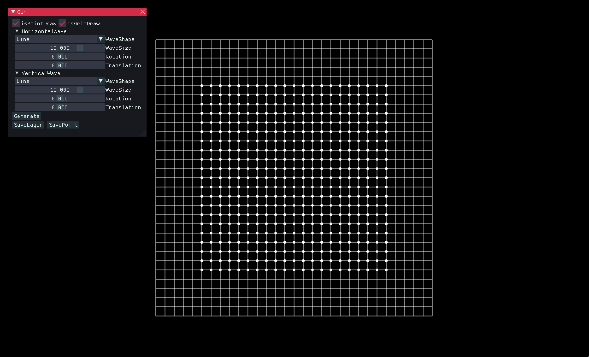
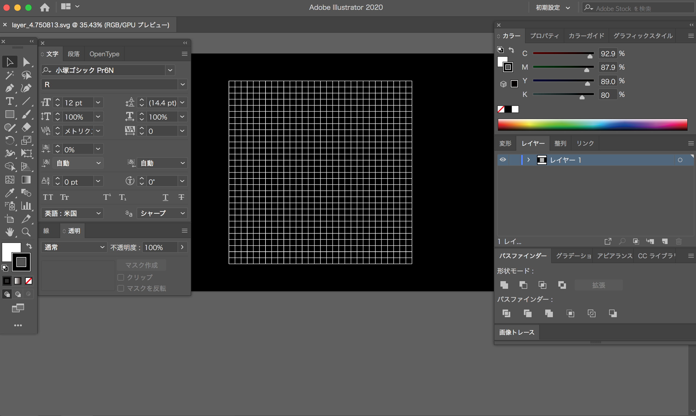
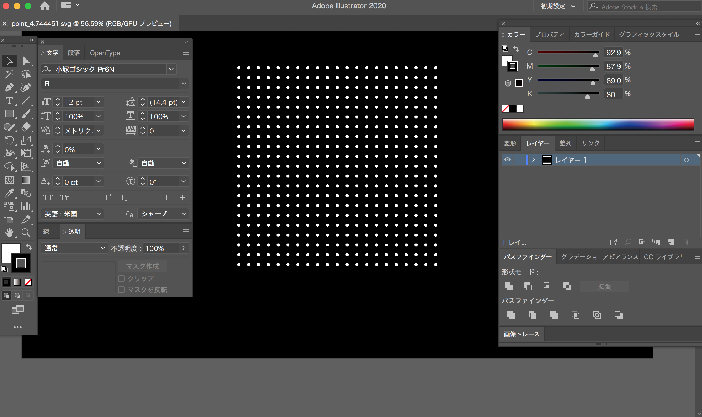

# GridIndex

This is a design tool that can operate the Grid geometrically and find the intersection points.  
inspired by Carsten Nicolai, "GridIndex", Gestalten, 2009/5/25  

## Version
* Xcode 10.1

* openFrameworks 0.10.1

## Addons
* [ofxImGui](https://github.com/jvcleave/ofxImGui)  

## System
* Structure  
polyShape -> alignGuide -> intersection -> ofApp    

* Procedure  
Select text box -> Drag & Drop save directory -> Generate grid -> Save layer/points -> Open SVG file in Illustrator 

* SVG file  
(Save directory)/layer_---.svg  

(Save directory)/point_---.svg  
 

